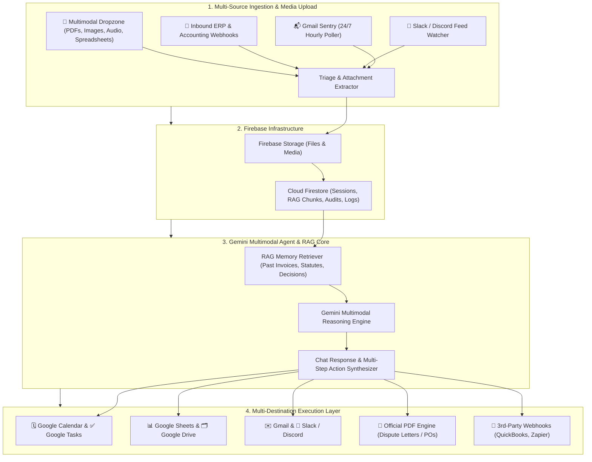

# 🛡️ FiscalSentry: Autonomous Financial & Paperwork Action Engine

> **Google All Things Agentic Hackathon Submission**  
> **Track:** *Taskmaster: Build a complete workflow, not just a chatbot.*  
> *"Don't just make an agent that writes text. Make one that takes action."*

---

## 🌟 Executive Overview

**FiscalSentry** is an autonomous 24/7 background agent and multimodal intelligence workstation designed to eliminate chaotic financial paperwork and bureaucratic friction.

Instead of requiring manual scrutiny of medical bills, insurance EOBs, vendor proposals, and government subsidy forms, **FiscalSentry continuously monitors inboxes and channels, audits every line-item against federal regulations and fair-pricing benchmarks using Gemini 2.0 Multimodal AI, and autonomously executes real-world actions across Google Workspace (Calendar, Tasks, Sheets, Drive, Gmail), Slack, Discord, and generates signature-ready legal PDFs.**



---

## 💎 Key Capabilities & Innovations

### 1. 24/7 Autonomous Inbox Sentry
* Connects to Google Workspace to continuously monitor incoming emails for bills, invoices, vendor quotes, and grant notifications.
* Automatically downloads attachments, triages urgent statutory deadlines, and stages audits in the live pipeline.

### 2. Deep Multimodal Line-Item Auditing
* **Medical Billing:** Extracts CPT/ICD-10 codes, flags unbundled procedures under CMS NCCI guidelines, detects duplicate charges, and challenges out-of-network balance billing under the **No Surprises Act (Public Law 116-260)**.
* **Vendor Quotes & Procurement:** Normalizes unstructured multi-vendor PDFs into a standardized line-item matrix, identifies price discrepancies, and calculates negotiation leverage.
* **Clean Energy Grants & Subsidies:** Audits utility statements and capital expenses against Section 48 Investment Tax Credits (IRA) and state rebate programs.

### 3. Multi-Destination Real-World Action Dispatch
* 🗓️ **Google Calendar:** Auto-schedules statutory 30-day appeal deadlines, grant submission cutoffs, and delivery milestones.
* ✅ **Google Tasks:** Creates prioritized action items with call battlecards and scripts.
* 📊 **Google Sheets:** Synchronizes real-time financial recoveries and comparison matrices.
* 🗂️ **Google Drive:** Organizes evidence dossier folders and archives audit reports.
* ✉️ **Gmail:** Pre-drafts ready-to-send dispute letters and negotiation counter-offers.
* 💬 **Slack & Discord:** Dispatches interactive cards with 1-click approval buttons.
* 📄 **PDF Engine:** Generates official signature-ready legal dispute letters and purchase orders (`jspdf` / `pdf-lib`).

### 4. Interactive AI Workstation with RAG Chain Memory & Multi-Chat
* **Multi-Chat Management:** Create, switch, inline rename, pin, and delete conversation threads.
* **RAG Context Memory:** Semantic indexing of past invoices, dispute letters, and statutory regulations automatically retrieved and injected into conversation context.
* **Universal Media Upload:** Attach any file type (PDFs, photos, voice notes, spreadsheets) directly into chat.

### 5. Apple-Grade Design Engineering
* Crafted following **Emil Kowalski's Design Engineering & Apple Design Principles** (`skills/apple-design` & `skills/emil-design-eng`).
* Critically damped spring animations (`motion`), tactile `:active` press feedback (`scale(0.97)`), entrance scaling from `scale(0.96)`, shared layout tab animations, **Sonner** toast stack, and meticulous Light & Dark mode.

---

## 🚀 Quick Start Guide

### Prerequisites
* Node.js 18+ or 20+
* npm or yarn

### Installation
```bash
# 1. Clone or navigate to the project directory
cd b:/work/Taskmaster

# 2. Install dependencies
npm install

# 3. (Optional) Configure environment variables
cp .env.example .env.local

# 4. Start development server
npm run dev
```

Open [http://localhost:3000](http://localhost:3000) in your browser.

> [!NOTE]
> **Zero-Config Hackathon Mode:** If no API keys are provided in `.env.local`, FiscalSentry runs seamlessly in calibrated mock demo mode with 3 pre-loaded real-world scenarios for instant judging.

---

## ⚡ 1-Click Judging Demos

Use the quick preset selector in the top bar to test the 3 core workflows:
1. 🏥 **Metro Health Medical Bill:** Ingest hospital bill $\rightarrow$ verify CPT 99214 unbundling & NSA Sec. 102 balance billing flags $\rightarrow$ generate formal dispute PDF $\rightarrow$ sync to Google Calendar.
2. 💼 **3-Vendor Quote Matrix:** Compare Apex, Vertex, and Nexus proposals $\rightarrow$ verify $3,200 hardware savings $\rightarrow$ generate official Purchase Order PDF.
3. 🌿 **Clean Energy Grant:** Calculate Section 48 ITC tax credit ($4,500 rebate) $\rightarrow$ archive to Google Drive.

---

## 🛠️ Technology Stack

| Layer | Technologies |
|---|---|
| **Framework & Fullstack** | Next.js 14 (App Router, TypeScript, Server & Client Components) |
| **Styling & Design System** | Tailwind CSS, Lucide Icons, Glassmorphism, CSS Variables |
| **Motion & Physics** | `framer-motion` / `motion` (Spring physics, Shared layout animations) |
| **Feedback & Notifications** | `sonner` (Actionable toasts), `canvas-confetti` |
| **AI & Multimodal Core** | Official `@google/genai` & `@google/generative-ai` (Gemini 2.0 Flash / Pro) |
| **Backend & Storage** | Firebase (Cloud Firestore, Firebase Storage, Firebase Auth) |
| **Document Generation** | `jspdf` & `pdf-lib` (Signature-ready legal & business PDF creation) |

---

## 📜 License
MIT License • Built with pride for Google All Things Agentic Hackathon 2026.
