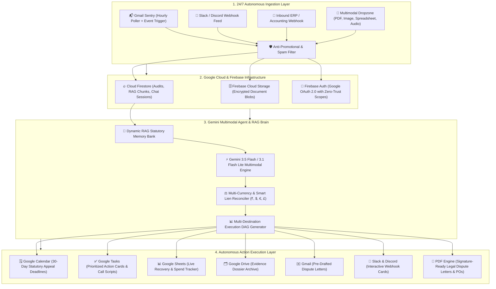

# 🛡️ FiscalSentry: Autonomous Financial Defense & Paperwork Action Engine

> **Google All Things Agentic Hackathon 2026 Submission**  
> **Primary Track:** 🏆 **The Taskmaster** — *Build a complete workflow, not just a chatbot. Don't just make an agent that writes text. Make one that takes action.*  
> **Secondary Accreditations:** 🤝 **The Collaborative Partner** & 🏢 **The Fortified Enterprise Fleet**  
> **Live Demo:** [https://fiscalsentry-void.web.app](https://fiscalsentry-void.web.app)  
> **GitHub Repository:** [https://github.com/ompatel3158/Fiscalsentry.git](https://github.com/ompatel3158/Fiscalsentry.git)

---

## 🌟 Executive Summary

Most AI assistants wait passively for prompts and generate conversational text. **FiscalSentry is an autonomous, event-driven action agent that works in the background while you do other things.**

FiscalSentry solves one of the most frustrating, multi-step chores in personal and enterprise finance: **bureaucratic paperwork, erroneous medical bills, deceptive vendor quotes, unallocated IPO mandate holds, and multi-currency billing violations.**

It continuously monitors incoming emails and webhooks 24/7, extracts line-item charges using **Gemini 3.5 Flash & Gemini 3.1 Flash Lite**, filters out promotional marketing noise, reconciles temporary liens (e.g., IPO application blocks/releases), audits charges against federal statutes (No Surprises Act, CMS NCCI, IRA Section 48), and **autonomously executes multi-step real-world actions across Google Workspace (Calendar, Tasks, Sheets, Drive, Gmail), Slack, Discord, and generates signature-ready legal dispute PDFs.**

---

## 🏗️ System Architecture



---

## 🏆 How FiscalSentry Wins "The Taskmaster" Track

The Taskmaster track challenges builders to create an **event-driven workflow with autonomous routing** that watches for a change, determines what needs to happen next, and interacts across multiple applications from start to finish without requiring hand-holding.

| Taskmaster Requirement | How FiscalSentry Implements It |
|---|---|
| **Event-Driven Workflow** | Automated hourly background worker polls Gmail and monitors inbound webhooks for bills, bank alerts, and receipts without requiring manual user triggers. |
| **Autonomous Routing** | Classifies incoming documents into categories (`medical_bill`, `vendor_quotes`, `grant_subsidy`, `invoice_receipt`, `hold_lien`, `unblocked_lien`), extracts amounts/currencies, and builds execution dependency DAGs. |
| **Multi-App Real Action** | Dispatches synchronized actions to **Google Calendar**, **Google Tasks**, **Google Sheets**, **Google Drive**, **Gmail**, **Slack**, and **Discord** in parallel. |
| **Heavy Lifting & Reasoning** | Audits CPT/ICD-10 codes, cross-references Medicare allowable fees (MPFS 2026), enforces No Surprises Act balance billing caps, normalizes multi-vendor quotes, and calculates Section 48 ITC clean energy tax credits. |
| **Zero Prompt Noise** | Strips promotional/coupon emails with high-precision regex & LLM classification, ensuring only genuine transactions enter the ledger. |

---

## 💎 Core Innovation Highlights

### 1. 24/7 Autonomous Inbox Sentry & Smart Reconciliation
* **Zero Configuration Needed:** Once connected, the autonomous poller checks Gmail every 1 hour (3,600s) and runs a catch-up check on startup.
* **IPO Lien & Hold Reconciliation:** Recognizes temporary capital blocks (e.g. ₹15,000 IPO application mandate) and automatic unblocks/revocations, adjusting actual net spend to **0.00** so cash balance remains 100% accurate.
* **Anti-Promotional Shield:** Automatically filters out marketing solicitations, coupons, and newsletters (e.g. "Costco Promotional Offers", "Flash Sales") before they pollute the financial liabilities ledger.

### 2. Multi-Currency Autonomous Ledger
* Supports full dynamic formatting and parsing for global currencies: **Indian Rupee (₹ INR)** with Indian numbering format, **US Dollar ($ USD)**, **Euro (€ EUR)**, **British Pound (£ GBP)**, and more.
* Provides **Multi-Currency Portfolio Cards** and real-time **Currency Switcher Filter Pills** in both the Command Center and Financial Year tabs.

### 3. Dynamic RAG Statutory Memory Bank
* Eliminates hardcoded or static citation fallbacks.
* Dynamically indexes user audited documents and matches statutory laws (`45 CFR § 149.410`, `CMS NCCI Chapter 1`, `IRA Section 48`) with relevance thresholds.
* Citations appear **only when genuinely relevant**, providing clickable proof behind every disputed dollar.

### 4. 1-Click Multi-Action Dispatch Queue
* **Google Calendar:** Inserts statutory 30-day appeal deadlines with alert reminders.
* **Google Tasks:** Stages checklist items with telephone negotiation battlecards.
* **Google Sheets:** Appends row-level recovery records to your tax ledger.
* **Google Drive:** Generates dedicated case folders with raw evidence.
* **Signature-Ready PDF Generator:** Client-side vector PDF generation (`jspdf`) creates ready-to-file legal dispute letters, medical appeals, and purchase orders.

---

## 🛠️ Google Technologies & Stack

* **AI & Agent Core:** 
  * Google Gemini 3.5 Flash / Gemini 3.1 Flash Lite / Gemini 3.6 Flash via `@google/generative-ai` & `@google/genai`
  * Antigravity Agent Runtime & Memory Framework
* **Google Cloud Infrastructure:**
  * **Firebase Hosting:** Global CDN Edge Deployment ([fiscalsentry-void.web.app](https://fiscalsentry-void.web.app))
  * **Cloud Firestore:** Zero-Trust NoSQL database for audited statements, chat sessions, and RAG knowledge
  * **Firebase Storage:** Cloud blob storage for uploaded PDFs and image receipts
  * **Firebase Authentication:** Google OAuth 2.0 with selective workspace scopes (`gmail.readonly`, `calendar.events`, `tasks`, `drive.file`)
* **Frontend & UX:**
  * Next.js 14 (App Router, TypeScript, React Server/Client Components)
  * Tailwind CSS & Lucide Icons with Light/Dark Theme Engine
  * `framer-motion` for spring physics, micro-interactions, and responsive drawers
  * `sonner` for actionable toast queues & `canvas-confetti` for recovery celebration

---

## 🚀 Quick Start & Local Setup

### Prerequisites
* Node.js 18+ or 20+
* npm or yarn
* A Google AI Studio API key ([aistudio.google.com](https://aistudio.google.com))

### Installation
```bash
# 1. Clone the repository
git clone https://github.com/ompatel3158/Fiscalsentry.git
cd Fiscalsentry

# 2. Install dependencies
npm install

# 3. Configure environment variables
cp .env.example .env.local
# Add your NEXT_PUBLIC_GEMINI_API_KEY and Firebase project settings

# 4. Start local development server
npm run dev
```

Open [http://localhost:3000](http://localhost:3000) in your browser.

> [!TIP]
> **Instant Judge Mode:** If no Google Workspace account is linked, click **`⚡ Load Temporary Demo Data`** in the Command Center to instantly test real-world scenarios (Metro Health $1,840 Medical Dispute, TechCorp $3,200 Hardware PO, and Section 48 Clean Energy Grant).

---

## 🎬 1-Click Judging Walkthrough Demo

1. **Autonomous Command Center:**
   * View live KPI cards (Original Billed, Benchmark, Disputed Overcharges, Subscriptions).
   * Click on any Month (e.g. *August 2026*) in the sidebar to open the full in-canvas **Month Overview Canvas** with itemized transactions and 1-click CSV export.
2. **Financial Year & Date Customization:**
   * Navigate to the **Financial Year** tab.
   * Switch between **FY 2026**, **Last 30 Days**, or **Custom Range** date pickers.
   * Test the **Multi-Currency Switcher** (`[ All ]`, `[ ₹ INR ]`, `[ $ USD ]`).
3. **Execute Real Actions:**
   * Select a document (e.g., *Metro General Hospital*).
   * Click **Execute All** or individual action items to stage calendar reminders, task checklists, and preview the signature-ready dispute PDF.
4. **AI Reasoning Chat & Dynamic RAG:**
   * Switch to the **AI Chat** tab.
   * Ask: *"Audit my recent Swiggy debits and tell me if there are duplicate charges"* or *"Explain the No Surprises Act balance billing violation on my hospital bill"*.
   * Verify dynamic model indicators, markdown tables, 1-click copy buttons, and solid black user bubble styling.

---

## 📄 License

This project is licensed under the **Non-Commercial Testing & Evaluation License** — see the [LICENSE](file:///b:/work/Taskmaster/LICENSE) file for details. Permitted for personal testing, academic research, and hackathon evaluation; commercial resale and monetization are strictly prohibited. Built with pride for the **Google All Things Agentic Hackathon 2026**.
